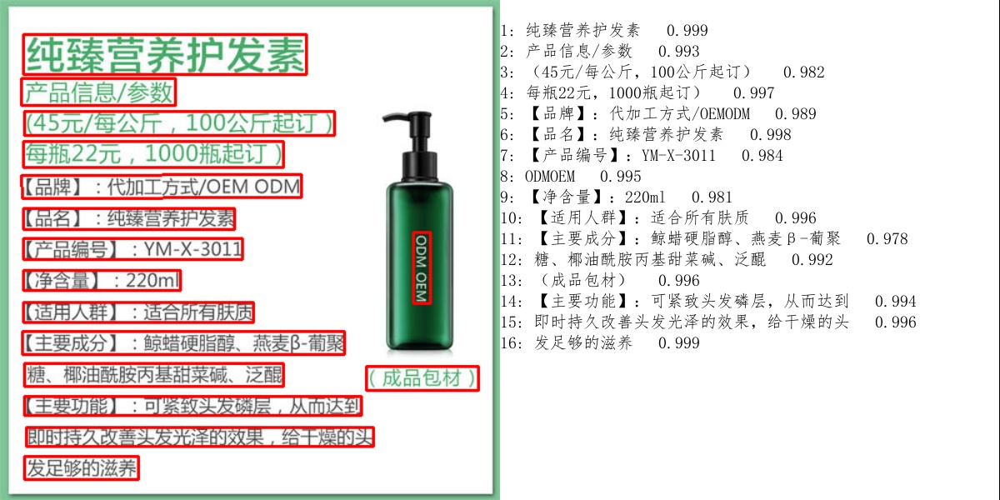

[**🇨🇳中文**](https://github.com/shibing624/imgocr/blob/main/README.md) | [**🌐English**](https://github.com/shibing624/imgocr/blob/main/README_EN.md) | [**📖文档/Docs**](https://github.com/shibing624/imgocr/wiki) 

<div align="center">
  <a href="https://github.com/shibing624/imgocr">
    
  </a>
</div>

-----------------

# imgocr: Image OCR toolkit
[](https://badge.fury.io/py/imgocr)
[](https://pepy.tech/project/imgocr)
[](CONTRIBUTING.md)
[](LICENSE)
[](requirements.txt)
[](https://github.com/shibing624/imgocr/issues)
[](#Contact)


**imgocr**：Python3 package for Chinese/English OCR, with paddleocr-v4 onnx model(~14MB).

基于PaddleOCR-v4-onnx模型（~14MB）推理，性能更高，可实现 CPU 上毫秒级的 OCR 精准预测，在通用场景上达到开源SOTA。


## Benchmark
OCR 检测/识别：

| 模型                    | 检测 Hmean(%) | 识别 Avg Accuracy(%) | GPU 推理耗时(ms) | CPU 推理耗时(ms) | 模型存储大小(M) | 字典数 |
|-------------------------|--------------|----------------------|-----------------|------------------|-----------|--------|
| PP-OCRv4-mobile(高效率)   | 77.79        | 78.20                | 2.719474        | 79.1097           | 14        | 6625   |

> 注：OCR 评估集是 PaddleOCR 自建的中文数据集，覆盖街景、网图、文档、手写多个场景，其中文本识别包含1.1w张图片，检测包含500张图片。GPU 推理耗时基于 NVIDIA Tesla T4 机器，精度类型为 FP32，CPU 推理速度基于 Intel(R) Xeon(R) Gold 5117 CPU @ 2.00GHz，线程数为 8，精度类型为 FP32。

## Demo

HuggingFace Demo: https://huggingface.co/spaces/shibing624/imgocr


run example: [examples/gradio_demo.py](https://github.com/shibing624/imgocr/blob/main/examples/gradio_demo.py) to see the demo:
```shell
python examples/gradio_demo.py
```

## Install
```shell
pip install -U imgocr
```

or

```shell
pip install -r requirements.txt
git clone https://github.com/shibing624/imgocr.git
cd imgocr
pip install --no-deps .
```

## Usage

### OCR识别

example: [examples/ocr_demo.py](https://github.com/shibing624/imgocr/blob/main/examples/ocr_demo.py)

```python
from imgocr import ImgOcr
m = ImgOcr()
result = m.ocr("data/11.jpg")
print("result:", result)
```

output:


### 命令行模式（CLI）

支持批量做OCR识别

code: [cli.py](https://github.com/shibing624/imgocr/blob/main/imgocr/cli.py)

```
> imgocr -h                                    
usage: imgocr [-h] --input_file INPUT_FILE [--output_file OUTPUT_FILE] [--model_type MODEL_TYPE] [--model_name MODEL_NAME] [--encoder_type ENCODER_TYPE]
                [--batch_size BATCH_SIZE] [--max_seq_length MAX_SEQ_LENGTH] [--chunk_size CHUNK_SIZE] [--device DEVICE]
                [--show_progress_bar SHOW_PROGRESS_BAR] [--normalize_embeddings NORMALIZE_EMBEDDINGS]

imgocr cli

optional arguments:
  -h, --help            show this help message and exit
  --input_file INPUT_FILE
                        input file path, text file, required
  --output_file OUTPUT_FILE
                        output file path, output csv file, default text_embs.csv
  --model_type MODEL_TYPE
                        model type: sentencemodel, word2vec, default sentencemodel
  --model_name MODEL_NAME
                        model name or path, default shibing624/imgocr-base-chinese
  --encoder_type ENCODER_TYPE
                        encoder type: MEAN, CLS, POOLER, FIRST_LAST_AVG, LAST_AVG, default MEAN
  --batch_size BATCH_SIZE
                        batch size, default 32
  --max_seq_length MAX_SEQ_LENGTH
                        max sequence length, default 256
  --chunk_size CHUNK_SIZE
                        chunk size to save partial results, default 1000
  --device DEVICE       device: cpu, cuda, default None
  --show_progress_bar SHOW_PROGRESS_BAR
                        show progress bar, default True
  --normalize_embeddings NORMALIZE_EMBEDDINGS
                        normalize embeddings, default False
  --multi_gpu MULTI_GPU
                        multi gpu, default False
```

run：

```shell
pip install imgocr -U
imgocr --image_dir data
```

> 输入图片目录（--image_dir， required）

## Contact

- Issue(建议)：[](https://github.com/shibing624/imgocr/issues)
- 邮件我：xuming: xuming624@qq.com
- 微信我：加我*微信号：xuming624, 备注：姓名-公司-NLP* 进NLP交流群。


## Citation

如果你在研究中使用了imgocr，请按如下格式引用：

APA:
```latex
Xu, M. imgocr: Image OCR toolkit (Version 0.0.1) [Computer software]. https://github.com/shibing624/imgocr
```

BibTeX:
```latex
@misc{imgocr,
  author = {Ming Xu},
  title = {imgocr: Image OCR toolkit},
  year = {2024},
  publisher = {GitHub},
  journal = {GitHub repository},
  howpublished = {\url{https://github.com/shibing624/imgocr}},
}
```

## License


授权协议为 [The Apache License 2.0](LICENSE)，可免费用做商业用途。请在产品说明中附加imgocr的链接和授权协议。


## Contribute
项目代码还很粗糙，如果大家对代码有所改进，欢迎提交回本项目，在提交之前，注意以下两点：

 - 在`tests`添加相应的单元测试
 - 使用`python -m pytest -v`来运行所有单元测试，确保所有单测都是通过的

之后即可提交PR。

## References
- [RapidOCR](https://github.com/RapidAI/RapidOCR)  
- [PaddleOCR](https://github.com/PaddlePaddle/PaddleOCR)  
- [Paddle2ONNX](https://github.com/PaddlePaddle/Paddle2ONNX)
- [ppocr-onnx](https://github.com/triwinds/ppocr-onnx)
